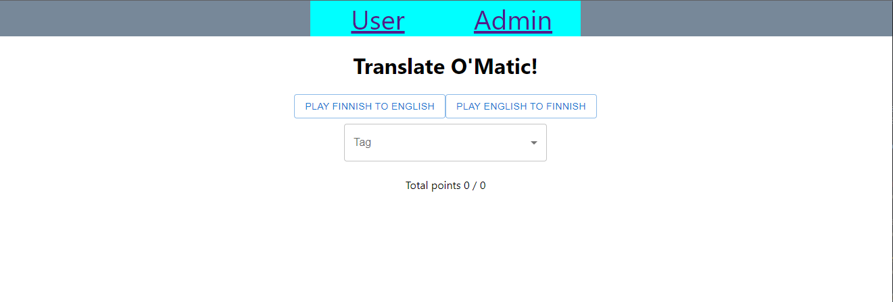
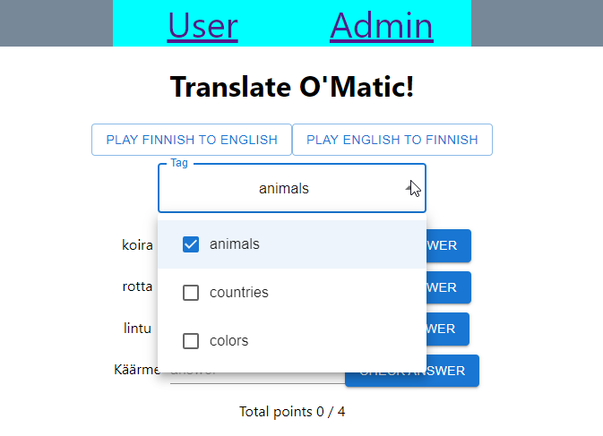
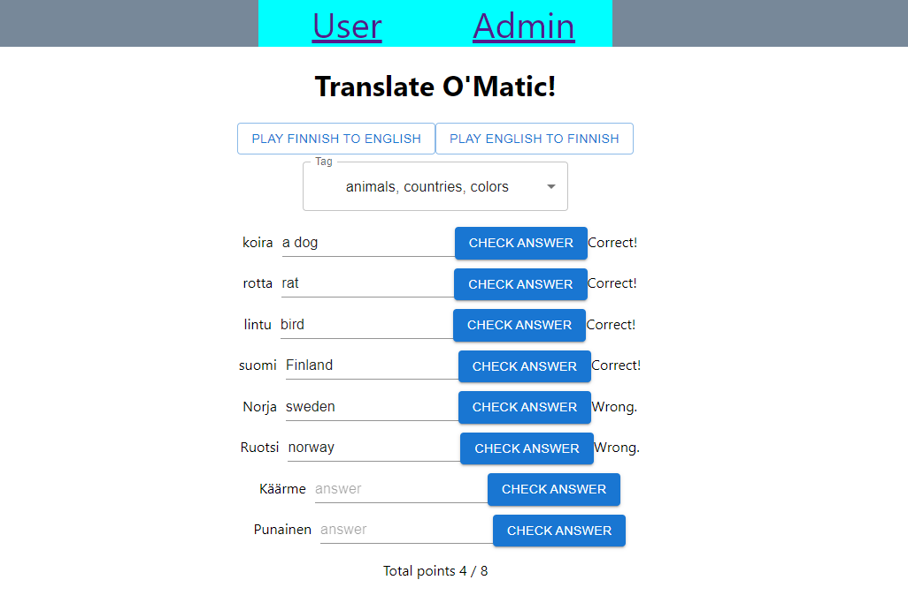
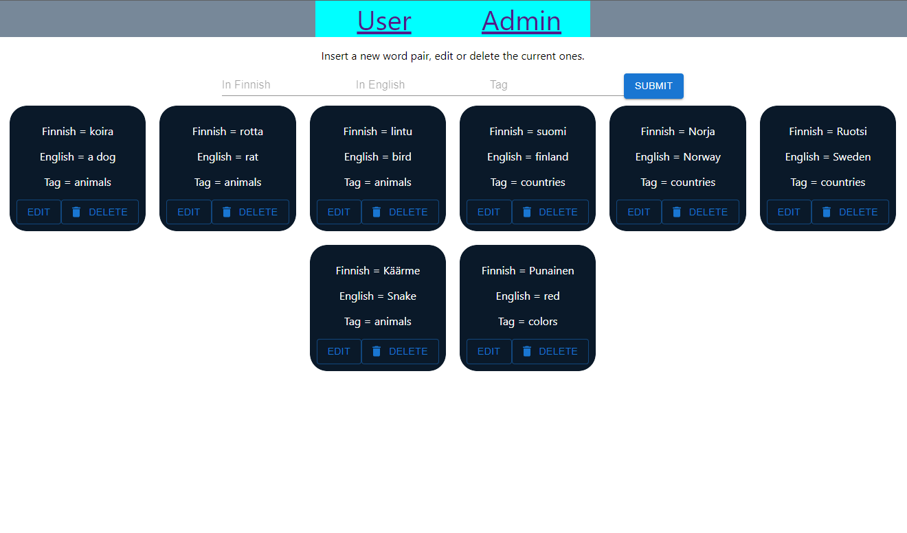
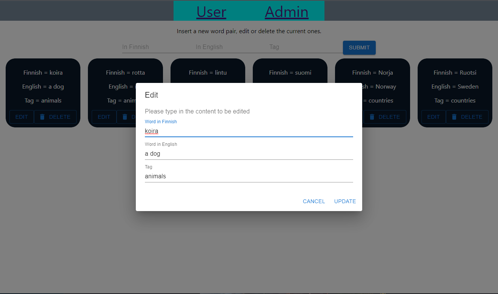
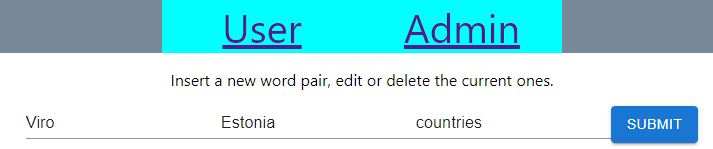

# full-stack-js-project

A web-based full stack application that helps you learn English by giving you words which you translate to Finnish.
The app tells you if your answers are correct or not. Hosted in Heroku and available for everyone to use at https://full-stack-js-project.herokuapp.com/

# Motivation

Implemented as a part of a school course during my 2nd year.

# Screenshots

Opening view

Select tags from the dropdown button

List of words to be translated

Admin view

Editing a word pair

Inserting a new pair

# How to use?

Choose one or more tags from the dropdown button. Then select would you like to translate from finnish to english or english to finnish.
You get a list of words and an input field next to it. Type in your translation and press the button next to it to check wether your answer was correct.

# Languages used

Node
React (JavaScript, CSS and HTML)
MySQL
